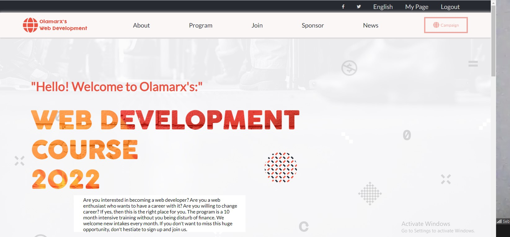

## Desktop Version of the site

  

## Mobile Version of the site

  

# Microverse' First Capstone Project
> The project is about Olamarx's Web Development Course. The website gives information about the course, the languages you can learn, when the classes start, and features some of the teachers that will take the students.

> The about-page can be accessed from the homepage with the 'About' link.
> The homepage can be accessed from the main logo, or the 'home' icon on the about-page.
> Also, on the mobile version, both these pages can be accessed through the 'hamburger menu'.

> This is my first capstone project at Microverse.
## The project template was gotten from [Behabce](https://www.behance.net/gallery/29845175/CC-Global-Summit-2015) and it is a product of Creative Commons.

## Built by Olaoluwa Owoeye (Olamarx)

- HTML
- CSS/Sass
  - Flexbox
  - Grid
  - mobile-first method
- JavaScript

## Live Demo

[Live Demo Link](https://olamarx.github.io/Capstone-project/)

## Set-up linters in your local machine

## Getting Started

#### run "git clone https://github.com/Olamarx/Capstone-project.git"

#### Kindly don't run the quotation mark with it.

## Author

👤 **Owoeye Olaoluwa (Olamarx)**

- GitHub: [@githubhandle](https://github.com/Olamarx)
- Twitter: [@twitterhandle](https://twitter.com/Owoeye0laoluwa)
- LinkedIn: [LinkedIn](https://www.linkedin.com/in/olaoluwa-owoeye-617702162/)
- Facebook: [Facebook](https://web.facebook.com/olaoluwa.owoeye.39)

## 🤝 Contributing

Contributions, issues, and feature requests are welcome!

Feel free to check the [issues page](https://github.com/Olamarx/Microverse-Portfolio-setup/issues).

## Show your support

Give a ⭐️ if you like this project!

## Acknowledgments

- Original design idea by <a href="https://www.behance.net/adagio07">Cindy Shin in Behance</a>.
- Image condent from <a href="https://www.behance.net/adagio07">Virag's Github</a>.

## 📝 License

This project is [MIT](./MIT.md) licensed.
